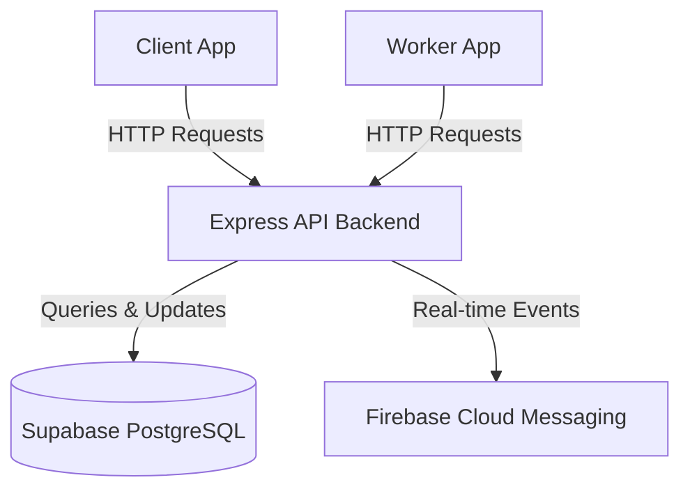

# CraftMatch Express Backend Documentation

This repository contains the backend implementation and Express.js API reference for the CraftMatch platform, interfacing directly with a Supabase PostgreSQL database.

---

## 1. Architecture Overview

### System Architecture
The backend is a Node.js Express application structured into modular routes, controllers, middleware, and services. It handles business logic that is not suited for client-side direct database execution, particularly job lifecycles, matching algorithms, background scheduling, payment configurations, and push notification dispatches.



### Directory Structure
- **[src/routes/](file:///c:/Users/user/Downloads/FinalYearProject/artisansApp_backend/src/routes)**: Express API route groups.
- **[src/controllers/](file:///c:/Users/user/Downloads/FinalYearProject/artisansApp_backend/src/controllers)**: Route handlers processing requests and executing query logic.
- **[src/middleware/](file:///c:/Users/user/Downloads/FinalYearProject/artisansApp_backend/src/middleware)**: JWT authentication parsing, role guards, and request sanitizers.
- **[src/services/](file:///c:/Users/user/Downloads/FinalYearProject/artisansApp_backend/src/services)**: Business operations (artisan matching algorithms, push notifications, storage interfaces).

---

## 2. API Endpoints

### 🔑 Authentication & Users
* **`POST /api/auth/register`**: Register a new client or worker account.
* **`POST /api/auth/login`**: Authenticate and return user session claims.
* **`GET /api/users/profile`**: Retrieve personal profile data.

### 💼 Jobs Lifecycle
* **`POST /api/jobs/create`**: Client initiates a job request (mode: `asap` / `scheduled` / `flexible`).
* **`GET /api/jobs/active`**: Retrieve ongoing jobs associated with the user.
* **`POST /api/jobs/:id/status`**: Transition a job through states (`searching` → `matching` → `arrived` → `in_progress` → `completed`).

### 🛠️ Artisan Dispatching
* **`GET /api/workers/nearby`**: Query active workers within a geospatial radius.
* **`POST /api/dispatch/accept`**: Worker accepts an incoming job offer dispatch.

---

## 3. Database & Authentication Mappings

### Database (Supabase PostgreSQL)
* **`users`**: Master profile containing user roles (`client` / `worker` / `admin`).
* **`jobs`**: Core request details, including state markers, coordinates, and prices.
* **`job_offers`**: Track dispatches sent to matching artisans.
* **`audit_logs`**: System audit records for verification portal operations.

### Role-Based Access Control (RBAC)
Routes are protected by custom authorization guards matching the user type:
1. **Client**: Can create jobs, review workers, and complete payments.
2. **Worker**: Can update GPS coordinates, toggles availability, and accept/complete dispatches.
3. **Admin**: Audits worker credentials, manages the service catalog, and handles disputes.

---

## 4. Getting Started & Development

### Installation
1. Navigate to the project directory:
   ```bash
   cd artisansApp_backend
   ```
2. Install npm dependencies:
   ```bash
   npm install
   ```
3. Copy `.env.example` to `.env` and fill in:
   - `SUPABASE_URL`
   - `SUPABASE_SERVICE_ROLE_KEY`
   - `PORT` (default `3000`)

### Development Scripts
* **Run in Dev Mode**: `npm run dev` (Hot-reload development server running on `http://localhost:3000`).
* **Test Suite**: `npm run test` (Executes the local automated test files).
* **Seed Database**: `npm run seed:dev` (Fills PostgreSQL tables with initial categories and mock users).
