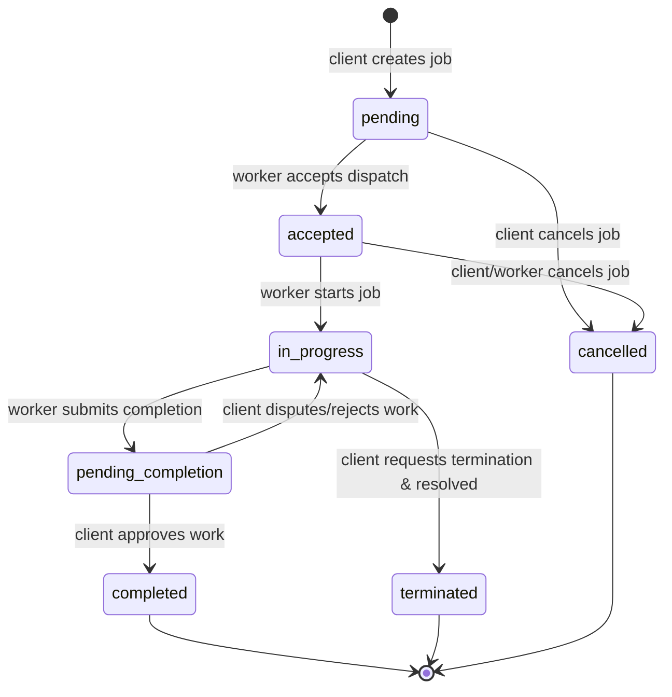

# Job Lifecycle & Notifications

This document describes the job matching flow, job lifecycle state machine, and the Firebase Cloud Messaging (FCM) push notification triggers.

## 1. Job Lifecycle State Machine

Jobs move through a set of structured states reflecting client requests, worker dispatches, active work, and completion:



### State Descriptions:
1. **`pending`**: The job has been posted by the client and is awaiting matching or worker acceptance.
2. **`accepted`**: A worker has accepted the dispatch offer but has not yet arrived or started.
3. **`in_progress`**: The worker has arrived at the location and marked the job as started.
4. **`pending_completion`**: The worker has submitted completion details (images, note, cost) for client approval.
5. **`completed`**: The client has approved the completion, closing the job lifecycle.
6. **`cancelled`**: The job is canceled by either user, potentially applying cancellation fees based on timing.
7. **`terminated`**: The client requested early termination, and it was accepted/resolved by the artisan.

---

## 2. Notification Dispatch Engine
Notifications are managed centrally in [src/services/notifyService.ts](file:///c:/Users/user/Downloads/FinalYearProject/artisansApp_backend/src/services/notifyService.ts) and integrated with Firebase Admin SDK.

### FCM Push Payloads
All push messages sent to users' registered device tokens carry rich payloads specifying `android` high-importance configurations, custom click actions (`FLUTTER_NOTIFICATION_CLICK`), and sound configurations.

```json
{
  "notification": {
    "title": "New job request",
    "body": "Plumbing repair · East Legon, Accra"
  },
  "data": {
    "type": "new_job",
    "jobId": "job-uuid",
    "roleTarget": "worker"
  }
}
```

### Registered Trigger Events:

| Trigger Service Method | Role Targeted | App Push Title | Push Message Body |
|---|---|---|---|
| `notifyWorkerNewJob` | `worker` | New job request | `<Job Title> · <Address>` |
| `notifyJobMatched` | `client` | Artisan matched | `<Worker Name> accepted your job` |
| `notifyClientWorkerApplied` | `client` | New artisan interested | `<Worker Name> wants to take your job` |
| `notifyWorkerApplicationAccepted` | `worker` | Application accepted | The client selected you for this job |
| `notifyWorkerOnTheWay` | `client` | Artisan on the way | Your artisan is heading to your location |
| `notifyWorkerArrived` | `client` | Artisan arrived | Your artisan has arrived at the job location |
| `notifyJobStarted` | `client` | Work started | Your artisan has started the job |
| `notifyCompletionSubmitted` | `client` | Work submitted for approval | Review the completed work and approve it |
| `notifyCompletionDisputed` | `worker` | Client reported job incomplete | The client says the job isn't finished yet |
| `notifyJobCompleted` | `client` | Job completed | Please rate your artisan |
| `notifyJobCancelled` | `worker` | Job cancelled | The client cancelled this job |
| `notifyWorkerCancelledJob` | `client` | Artisan cancelled | Your artisan cancelled this job |
| `notifyChatMessage` | `recipient` | New message | Text from `<Sender Name>` |
| `notifyClientCancelledWithFee` | `worker` | Job cancelled by client | The client cancelled. You are entitled to compensation |
| `notifyTerminationRequested` | `worker` | Client requests job termination | The client has requested to terminate this job |
| `notifyTerminationResolved` | `client` | Termination `<resolved_status>` | The artisan has `<accepted/declined>` the termination |
